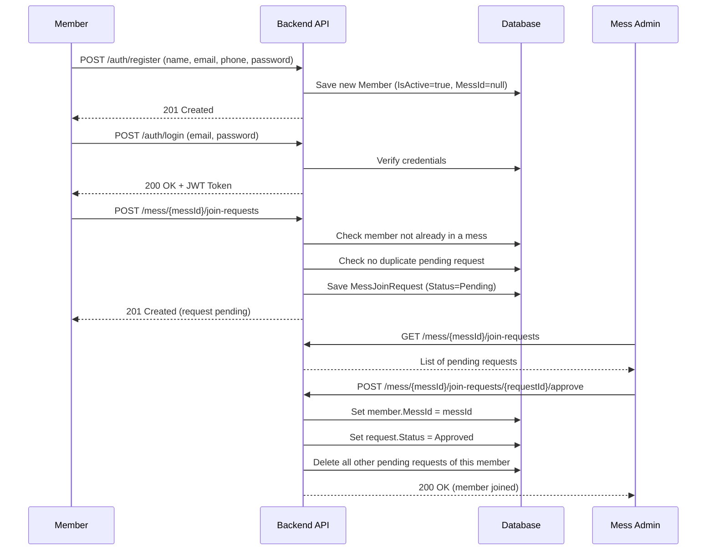
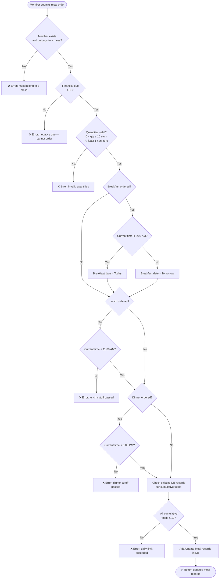
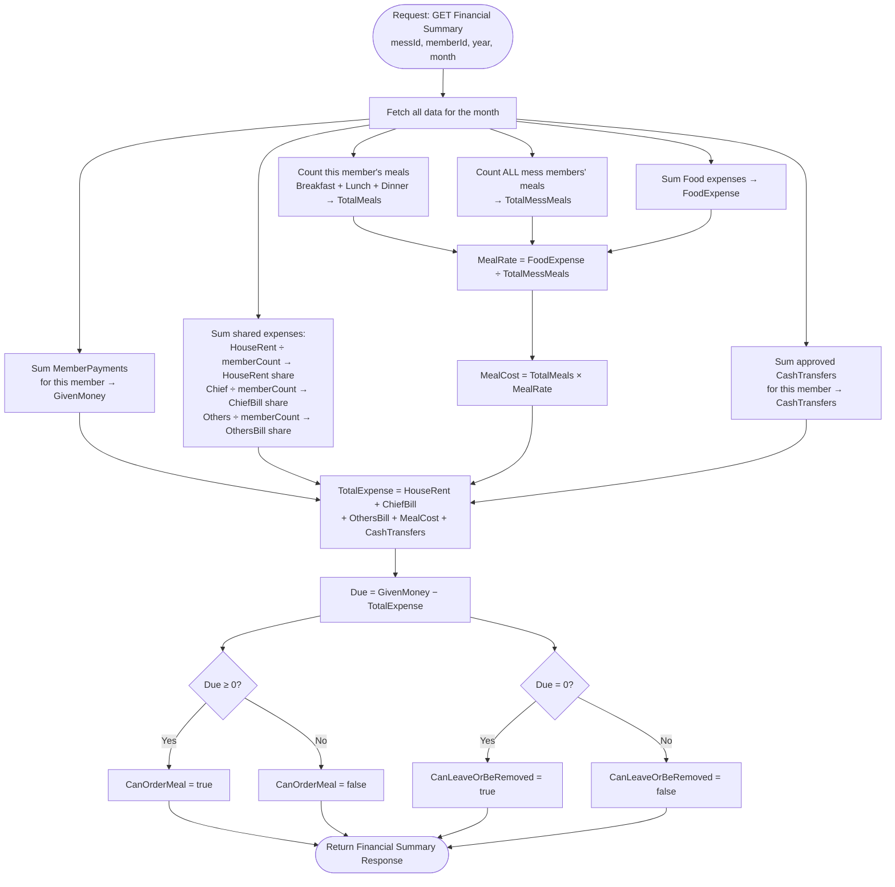

# 🍽️ Mess Management System

A full-stack web application for managing shared residential dining arrangements (a "mess"). It handles member onboarding, daily meal ordering, shared expense tracking, payment management, and financial summaries — all with role-based access between **admin** and **regular members**.

---

## 📚 Table of Contents

- [Overview](#overview)
- [Tech Stack](#tech-stack)
- [Project Structure](#project-structure)
- [Features](#features)
- [Event Flow Diagrams](#event-flow-diagrams)
- [Domain Model](#domain-model)
- [Financial Calculation Logic](#financial-calculation-logic)
- [API Endpoints](#api-endpoints)
- [Getting Started](#getting-started)
- [Environment Configuration](#environment-configuration)

---

## Overview

The Mess Management System allows a group of people living together (a "mess") to:

- Register and authenticate with JWT-based security
- Create or join a mess using a unique 6-digit mess code
- Order daily meals (Breakfast, Lunch, Dinner) with time-based cutoffs
- Track shared expenses (Food, House Rent, Chief salary, Others)
- Record member payments and cash transfers
- View per-member financial summaries with automatic due calculation
- Enforce financial rules: members with unpaid dues cannot order more meals or leave the mess

---

## Tech Stack

| Layer      | Technology                                |
|------------|-------------------------------------------|
| **Backend**  | ASP.NET Core 8 (C#), Entity Framework Core |
| **Database** | MySQL (via Pomelo EF provider)             |
| **Auth**     | JWT Bearer Tokens                          |
| **Frontend** | React (Vite), Vanilla CSS                  |
| **API Style**| RESTful JSON API                           |

---

## Project Structure

```
Project/
├── MessManagementSystem.Api/          # Backend ASP.NET Core project
│   ├── Controllers/                   # REST API controllers
│   │   ├── AuthController.cs
│   │   ├── MessController.cs
│   │   ├── MealController.cs
│   │   ├── ExpenseController.cs
│   │   ├── MemberPaymentController.cs
│   │   ├── MemberCashTransferController.cs
│   │   └── FinancialController.cs
│   ├── Services/                      # Business logic layer
│   │   ├── AuthService.cs
│   │   ├── MessService.cs
│   │   ├── MealService.cs
│   │   ├── ExpenseService.cs
│   │   ├── MemberPaymentService.cs
│   │   ├── MemberCashTransferService.cs
│   │   ├── FinancialService.cs
│   │   └── PasswordService.cs
│   ├── Models/                        # EF Core domain models
│   │   ├── Member.cs
│   │   ├── Mess.cs
│   │   ├── Meal.cs
│   │   ├── Expense.cs
│   │   ├── MemberPayment.cs
│   │   ├── MemberCashTransfer.cs
│   │   └── MessJoinRequest.cs
│   ├── DTOs/                          # Request/Response data transfer objects
│   ├── Data/                          # DbContext & migrations
│   └── Program.cs                     # App bootstrap & DI registration
│
├── MessManagementSystem.Tests/        # Unit/integration tests
│
└── mess-frontend/                     # React frontend (Vite)
    └── src/
        ├── pages/
        │   ├── Login.jsx / Register.jsx
        │   ├── Dashboard.jsx
        │   ├── CreateMess.jsx / JoinMess.jsx
        │   ├── MessDetails.jsx
        │   ├── Meals.jsx
        │   ├── Expenses.jsx
        │   ├── Payments.jsx
        │   ├── CashTransfers.jsx
        │   └── FinancialSummary.jsx
        ├── components/
        │   ├── Layout.jsx
        │   ├── ProtectedRoute.jsx
        │   └── Feedback.jsx
        ├── api/                       # Axios API call modules
        └── context/                   # React context (auth state)
```

---

## Features

### 👤 Authentication
- Register with name, email, phone, and password (BCrypt hashed)
- Login returns a JWT token (2-hour expiry)
- All routes except register/login are protected

### 🏠 Mess Management (Admin only)
- Create a mess → auto-generates a unique 6-digit mess code
- Update mess name
- View and manage join requests (approve / reject)
- Remove members (only when their financial balance is settled)
- Delete the mess (only when all members have zero balance)

### 🚪 Joining a Mess
- Search mess by 6-digit code and send a join request
- Admin approves or rejects; approval cancels all other pending requests of the member

### 🍳 Meal Ordering
- Order Breakfast, Lunch, and Dinner (1–10 per type per day)
- **Breakfast**: orders before 5:00 AM go to today; at/after 5:00 AM go to tomorrow
- **Lunch**: must be ordered before 11:00 AM
- **Dinner**: must be ordered before 8:00 PM
- Members with a **negative due** (expenses exceed payments) are blocked from ordering
- Update or delete past meal records

### 💸 Expenses
- Categories: **Food**, **House Rent**, **Chief**, **Others**
- Food expenses are distributed proportionally based on each member's meal count
- House Rent, Chief, and Others are split equally among all members

### 💰 Member Payments
- Admin records payments made by members into the mess fund
- Visible in each member's financial summary

### 🔁 Cash Transfers
- Admin initiates a cash transfer (mess fund → member)
- Member must approve the transfer; only then is it deducted from their expense
- Status: Pending → Approved / Rejected

### 📊 Financial Summary
- Per-member monthly summary including:
  - Total money given (payments)
  - House rent share, chief bill share, others share
  - Meal count × meal rate = meal cost
  - Cash transfers received
  - Total expense and **Due** (positive = credit, negative = owes money)

---

## Event Flow Diagrams

### 1. Member Onboarding & Mess Joining Flow



---

### 2. Meal Ordering Flow (with Financial Guard)



---

### 3. Financial Summary Calculation Flow



---

## Domain Model

```
Member ─────────────── Mess
  │  (many-to-one)       │
  │                      │── Members (one-to-many)
  │                      │── JoinRequests (one-to-many)
  │                      │── Expenses (one-to-many)
  │                      └── MemberPayments (one-to-many)
  │
  ├── Meals (own meal records)
  ├── RecordedExpenses (expenses this member logged)
  ├── Payments (money this member paid to the mess)
  └── CashTransfers (cash the mess paid to this member)
```

**Key relationships:**
- A `Member` can belong to **at most one** `Mess` (via `MessId`)
- A `Mess` has exactly **one admin** (via `AdminMemberId`)
- `Expense` categories: `Food`, `HouseRent`, `Chief`, `Others`, `MemberCashTransfer`
- `MemberCashTransfer` starts as `Pending`; member must `Approve` it for it to count as expense

---

## Financial Calculation Logic

| Component        | Formula                                                        |
|------------------|----------------------------------------------------------------|
| **Meal Rate**    | `Total Food Expense ÷ Total Mess Meals (for the month)`        |
| **Meal Cost**    | `Member's Total Meals × Meal Rate`                             |
| **Shared Bills** | `Total Category Expense ÷ Number of Members`                   |
| **Total Expense**| `HouseRent + Chief + Others + MealCost + CashTransfers`        |
| **Due**          | `GivenMoney − TotalExpense` (positive = credit, negative = owes)|

**Business Rules:**
- 🚫 Members with **Due < 0** cannot order meals or increase existing orders
- 🚫 Members with **Due ≠ 0** cannot leave the mess or be removed by admin
- 🚫 A mess cannot be deleted unless **all members have Due = 0**
- ✅ Cash transfers only count as expense after **member approval**

---

## API Endpoints

### Auth
| Method | Endpoint           | Description              |
|--------|--------------------|--------------------------|
| POST   | `/auth/register`   | Register a new member    |
| POST   | `/auth/login`      | Login and get JWT token  |

### Mess
| Method | Endpoint                                            | Description                    |
|--------|-----------------------------------------------------|--------------------------------|
| POST   | `/mess`                                             | Create a new mess              |
| GET    | `/mess/{messId}`                                    | Get mess details               |
| PUT    | `/mess/{messId}`                                    | Update mess name (admin)       |
| DELETE | `/mess/{messId}`                                    | Delete mess (admin)            |
| POST   | `/mess/{messId}/join-requests`                      | Send a join request            |
| GET    | `/mess/{messId}/join-requests`                      | List join requests (admin)     |
| POST   | `/mess/{messId}/join-requests/{id}/approve`         | Approve a join request (admin) |
| POST   | `/mess/{messId}/join-requests/{id}/reject`          | Reject a join request (admin)  |
| DELETE | `/mess/{messId}/members/{memberId}`                 | Remove a member (admin)        |
| DELETE | `/mess/{messId}/leave`                              | Leave the mess                 |

### Meals
| Method | Endpoint                   | Description                  |
|--------|----------------------------|------------------------------|
| POST   | `/meals`                   | Order meals                  |
| GET    | `/meals`                   | Get my meals                 |
| PUT    | `/meals/{mealId}`          | Update a meal record         |
| DELETE | `/meals/{mealId}`          | Delete a meal record         |
| GET    | `/meals/totals`            | Get my meal totals           |
| GET    | `/meals/mess/{messId}/totals` | Get mess-wide meal totals |

### Expenses
| Method | Endpoint                | Description                        |
|--------|-------------------------|------------------------------------|
| POST   | `/expenses`             | Add an expense (admin)             |
| GET    | `/expenses/mess/{messId}` | Get all expenses for a mess      |
| PUT    | `/expenses/{expenseId}` | Update an expense (admin)          |
| DELETE | `/expenses/{expenseId}` | Delete an expense (admin)          |

### Payments
| Method | Endpoint                           | Description                     |
|--------|------------------------------------|----------------------------------|
| POST   | `/member-payments`                 | Record a payment (admin)         |
| GET    | `/member-payments/mess/{messId}`   | Get all payments for a mess      |

### Cash Transfers
| Method | Endpoint                                      | Description                         |
|--------|-----------------------------------------------|--------------------------------------|
| POST   | `/cash-transfers`                             | Create a cash transfer (admin)       |
| GET    | `/cash-transfers/mess/{messId}`               | Get all transfers for a mess         |
| POST   | `/cash-transfers/{id}/approve`                | Member approves transfer             |
| POST   | `/cash-transfers/{id}/reject`                 | Member rejects transfer              |

### Financial
| Method | Endpoint                                                        | Description                    |
|--------|-----------------------------------------------------------------|--------------------------------|
| GET    | `/financial/{messId}/members/{memberId}?year=&month=`          | Get member financial summary   |

---

## Getting Started

### Prerequisites
- [.NET 8 SDK](https://dotnet.microsoft.com/download)
- [Node.js 18+](https://nodejs.org/)
- [MySQL 8+](https://www.mysql.com/)

### 1. Clone the repository

```bash
git clone <repository-url>
cd Project
```

### 2. Setup the Backend

```bash
cd MessManagementSystem.Api

# Restore packages
dotnet restore

# Apply database migrations
dotnet ef database update

# Run the API
dotnet run
```

The API will be available at `http://localhost:5000` (or as configured).

### 3. Setup the Frontend

```bash
cd mess-frontend

# Install dependencies
npm install

# Run the dev server
npm run dev
```

The frontend will be available at `http://localhost:5173` (Vite default).

---

## Environment Configuration

### Backend (`appsettings.json`)

```json
{
  "ConnectionStrings": {
    "DefaultConnection": "Server=localhost;Port=3306;Database=MessManagementSystem;User=root;Password=YOUR_PASSWORD;"
  },
  "Jwt": {
    "Key": "YOUR_SECRET_KEY_MIN_32_CHARS",
    "Issuer": "MessManagementSystem.Api",
    "Audience": "MessManagementSystem.Client"
  }
}
```

> ⚠️ **Important:** Replace the JWT key with a strong, random secret before deploying. Never commit real secrets to source control.

---

## 🤝 Roles & Permissions

| Action                        | Member | Admin |
|-------------------------------|:------:|:-----:|
| Register / Login              | ✅     | ✅    |
| Create a mess                 | ✅     | ✅    |
| Send a join request           | ✅     | ✅    |
| Approve / Reject join request | ❌     | ✅    |
| Order / manage own meals      | ✅     | ✅    |
| Add / edit expenses           | ❌     | ✅    |
| Record member payments        | ❌     | ✅    |
| Initiate cash transfers       | ❌     | ✅    |
| Approve / reject cash transfer| ✅     | ❌    |
| Remove members                | ❌     | ✅    |
| Delete mess                   | ❌     | ✅    |
| View financial summary        | ✅     | ✅    |

---

*Built as a Software Engineering academic project.*
