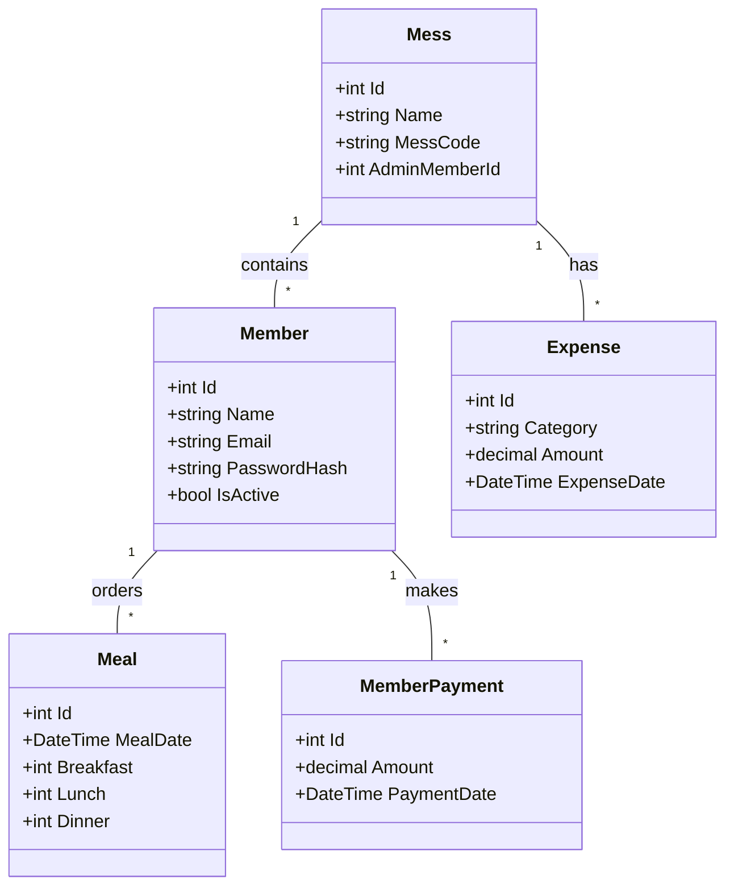
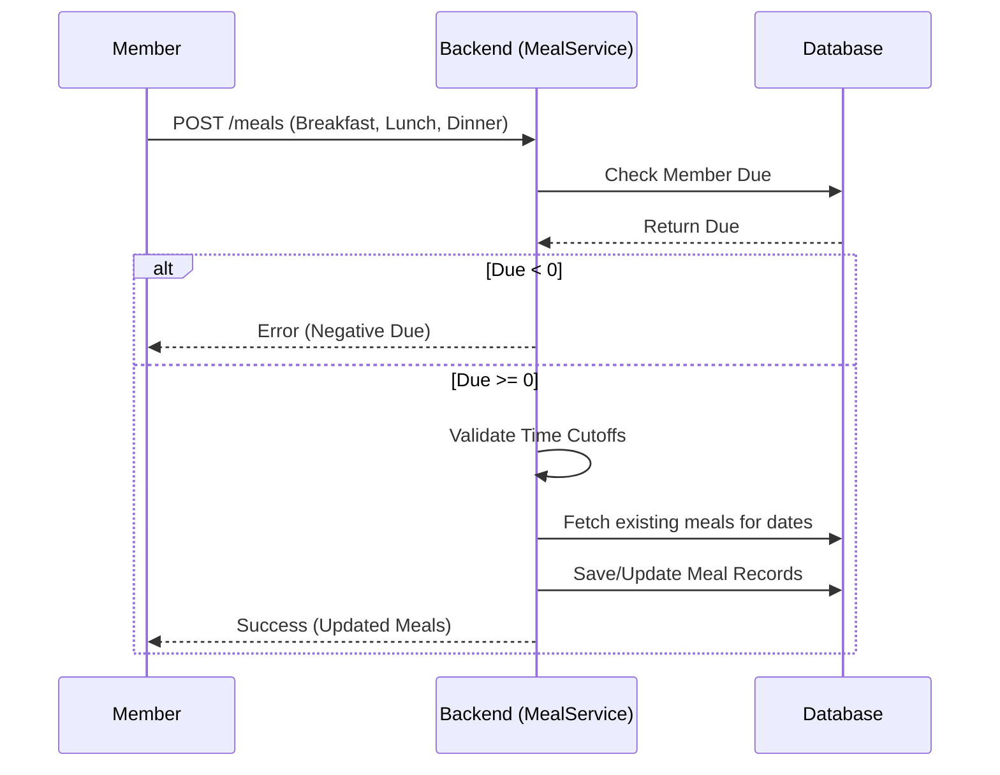
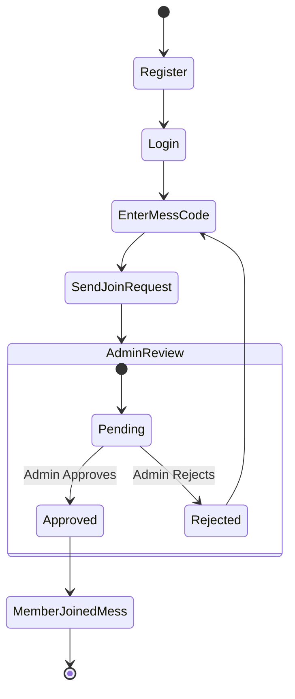
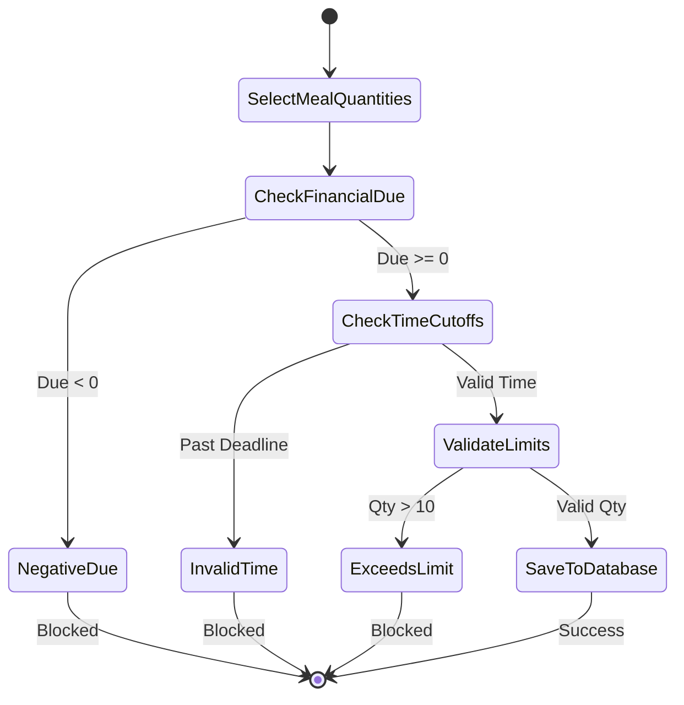
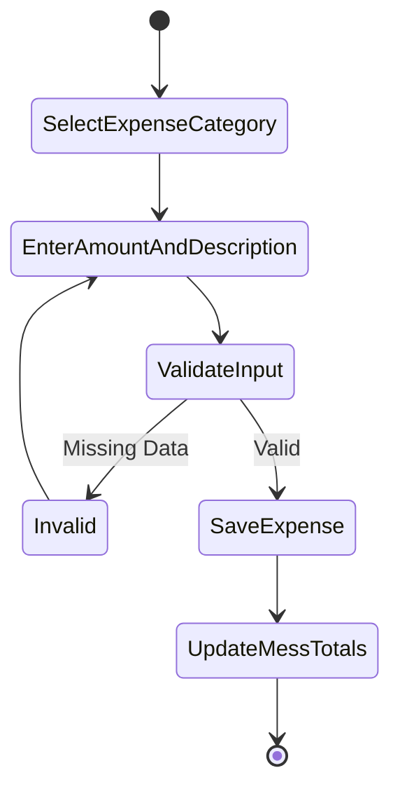
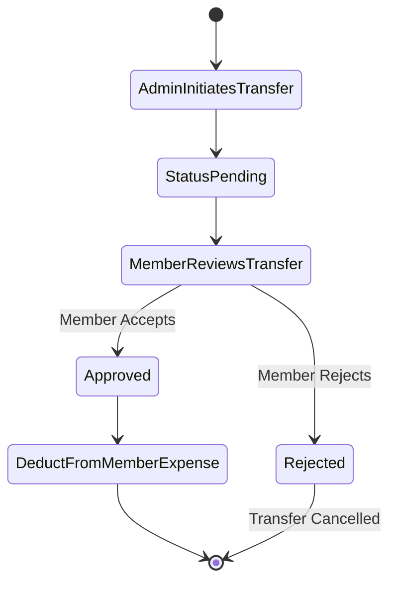
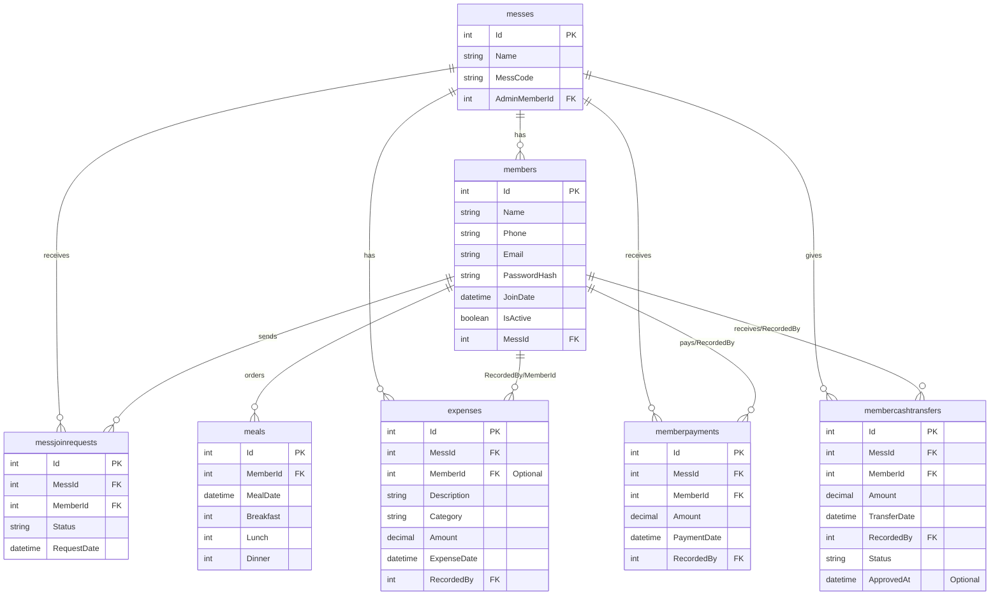

# Project Proposal: Mess Management System

## 1. Introduction

### a. Problem Statement
Managing a shared living arrangement (a "mess") involves complex financial tracking, daily meal management, and transparent expense sharing. Currently, many messes rely on manual ledgers or basic spreadsheets, leading to errors in calculation, disputes over shared bills, and inefficiencies in meal ordering (e.g., ordering food too late or wasting food). There is a need for a centralized, transparent, and automated system to manage these operations effectively.

### b. Case Study with Problem Identification
**Case Study:** A bachelor mess consisting of 10 members.
**Problems Identified:**
- The mess manager (admin) struggles to calculate precise individual meal costs because the total grocery expense needs to be divided by the total number of meals consumed by all members over the month.
- Fixed expenses like rent and the cook's salary are hard to track alongside individual cash advances.
- Members frequently forget to cancel their meals on time, leading to food wastage and financial loss.
- Lack of real-time transparency leaves members unsure of their current due/balance until the end of the month.

### c. Specification of overall high-level goals
- **Automate Financials:** Accurately track payments, expenses, and automatically calculate individual dues based on meal consumption and shared costs.
- **Meal Management:** Provide a real-time meal ordering system with strict time-based cutoffs.
- **Transparency:** Allow every member to view their real-time financial summary at any point in the month.
- **Access Control:** Differentiate between Admin (Mess Manager) and Member roles for secure data management.

---

## 3. Business Requirement Analysis

### a. Information Gathering
**i. Identify how the current system works:** 
Currently, members write their daily meal counts in a paper register. The manager collects money manually, writes it down, and keeps grocery receipts. At the end of the month, the manager calculates the meal rate manually and determines who owes what.
**ii. Identify inefficiencies of the current system:** 
Manual calculation errors, lost receipts, inability to know current balance mid-month, disputes over late meal cancellations.
**iii. Identify scopes of improvement for the future system:** 
Digitizing meal entries with deadlines, automating the meal rate and due calculations, providing personalized dashboards.

### b. Specification of goals and objectives
- “We need Real-Time Monthly Financial Summaries for each member showing their total expenses, payments, and current due.”
- “We need a daily meal ordering system that locks inputs after specific times (e.g., 5:00 AM for Breakfast).”

### c. Specification of Detailed Business Processes
**i. Functionality Grouping:** 
- User Management (Auth, Join Requests)
- Meal Management (Ordering, Deadlines, Totals)
- Financial Management (Expenses, Payments, Cash Transfers, Due Calculation)

**ii. Stakeholder Identification:** 
- Mess Admin (Manager)
- Regular Members

**iii. Scope Definition:** 
- **Included:** Meal tracking, expense logging, auto-calculation of dues, member join approvals.
- **Excluded:** Online payment gateway integration (payments are tracked manually in the system), inventory/grocery stock tracking.

### d. Business Requirements Validation
The proposed automated calculations for the meal rate `(Total Food Expense / Total Mess Meals)` and individual due `(Total Given Money - Total Personal Expense)` align perfectly with the standard manual accounting rules used in bachelor messes.

---

## 4. Software Requirements Specification

### a. Define functional requirements
**i. User Interactions and Inputs:** Members input daily meal counts. Admin inputs expenses, cash transfers, and member payments.
**ii. Business Logic and Processing Rules:** 
- A member cannot order meals if their financial due is negative.
- A member cannot leave the mess if their due is not exactly zero.
- Meal orders have strict cutoffs (11 AM for lunch, 8 PM for dinner).
**iii. Data Management and Storage:** Relational database storing Members, Messes, Meals, Expenses, and Cash Transfers.
**iv. System Outputs and Reports:** Per-member financial summary report, mess-wide meal totals.

### b. Define non-functional requirements
**i. Performance and Scalability:** The system should quickly calculate financial summaries on-the-fly without noticeable delay for a mess size of up to 50 members.
**ii. Availability and Reliability:** 99% uptime, as members need to update meals daily.
**iii. Security and Privacy:** JWT-based authentication. Members can only see their own financials; only the Admin can modify expenses and approve members. Password hashing via BCrypt.
**iv. Usability and Accessibility:** Mobile-responsive frontend so members can easily update meals from their phones.

### c. Define System Models / Diagrams using UML

#### i. Use Case Diagram
```mermaid
usecaseDiagram
    actor Admin
    actor Member
    
    usecase "Register/Login" as UC1
    usecase "Create Mess" as UC2
    usecase "Join Mess" as UC3
    usecase "Order Meals" as UC4
    usecase "View Financial Summary" as UC5
    usecase "Manage Expenses" as UC6
    usecase "Record Payments" as UC7
    usecase "Approve/Reject Join Requests" as UC8
    
    Member --> UC1
    Member --> UC3
    Member --> UC4
    Member --> UC5
    
    Admin --> UC1
    Admin --> UC2
    Admin --> UC4
    Admin --> UC5
    Admin --> UC6
    Admin --> UC7
    Admin --> UC8
```

#### ii. Class Diagram


#### iii. Sequence Diagram (Meal Ordering)


#### iv. Activity Diagrams (4 Examples)

**1. Activity Diagram: Member Registration & Mess Joining**


**2. Activity Diagram: Order Meal**


**3. Activity Diagram: Add Expense (Admin)**


**4. Activity Diagram: Cash Transfer Workflow**


#### v. ER Diagrams


#### vi. Schema Diagrams
*(To be added)*

#### vii. Data Flow Diagrams (Some)
*(To be added)*

---

## 5. Software Development
### a. Backend Design
- **Architecture:** Monolithic REST API utilizing the Repository/Service pattern.
- **Framework:** ASP.NET Core 8 with Entity Framework Core.
- **Database:** MySQL.
- **Security:** JWT (JSON Web Tokens) for stateless authentication.

### b. UX/UI Design
- **Framework:** React.js built with Vite.
- **Styling:** Custom Vanilla CSS focusing on a clean, responsive, and mobile-friendly interface.
- **Dashboards:** Distinct views for Admin (Expense/Member management) and Members (Meal tracking/Personal financials).

---

## 6. Software Testing
- **Unit Testing:** Testing individual service logic (e.g., testing the financial calculation formulas).
- **Integration Testing:** Ensuring the API endpoints correctly interact with the MySQL database.
- **Validation Testing:** Verifying that meal ordering time cutoffs and negative due constraints work correctly under various scenarios.

---

## 7. Software Implementation
- **Deployment Strategy:** 
  - Backend API hosted on a cloud provider (e.g., Azure or Render).
  - Database hosted on a managed MySQL service.
  - Frontend hosted on Vercel or Netlify.
- **CI/CD:** Automated build and deployment pipelines using GitHub Actions.

---

## 8. Project Presentation
- Demonstration of the end-to-end flow: Creating a mess, members joining, ordering meals, adding expenses, and viewing the auto-calculated financial summaries.
- Highlighting the real-world utility of the financial constraints (e.g., blocking meal orders for unpaid dues).
